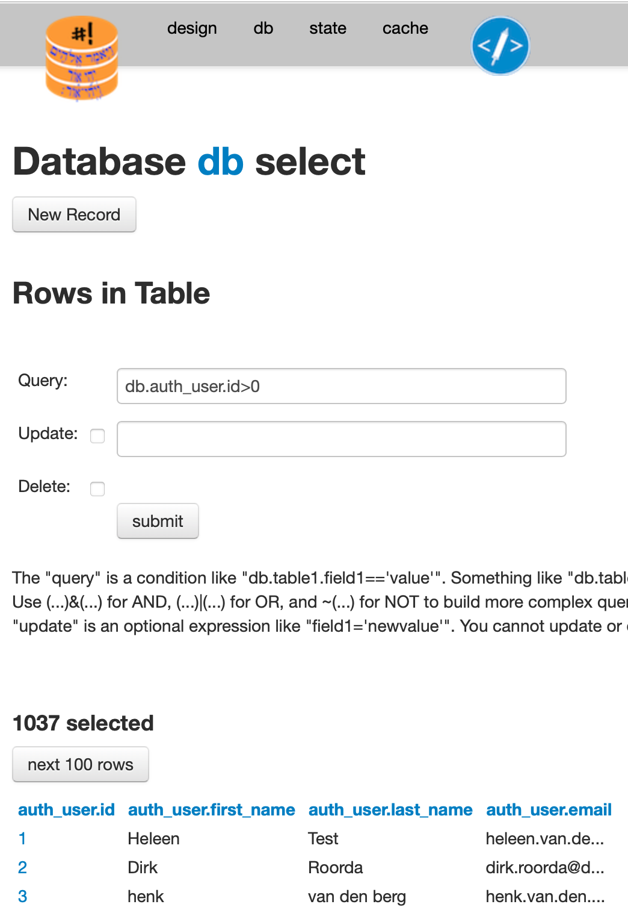
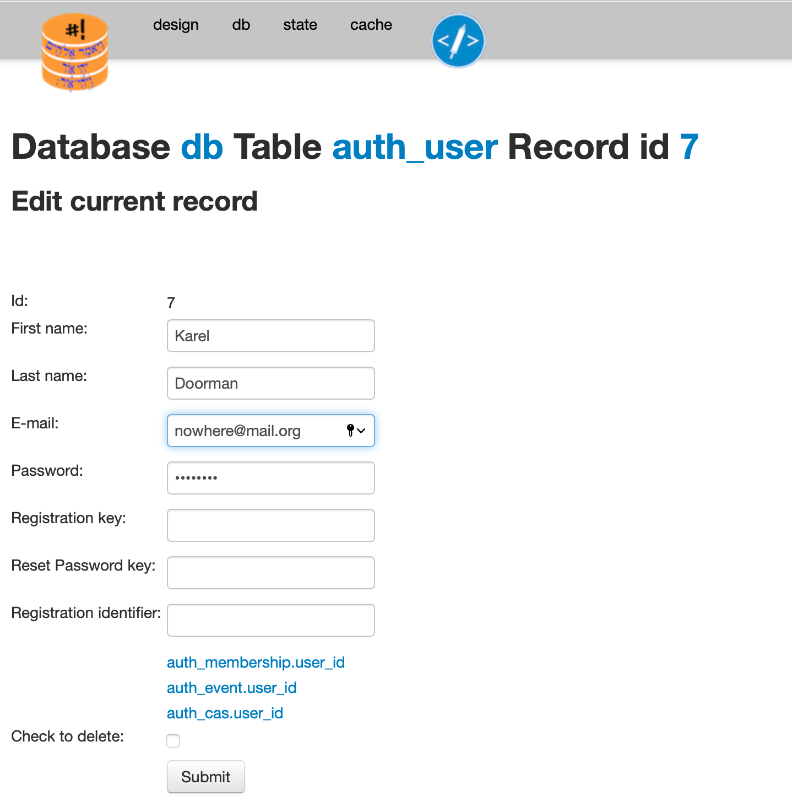

# Admin

Web2py offers a handy [administrative webapp]({{web2pyAdmin}}), by which you can inspect
the database and errors of SHEBANQ in the browser.
The web2py docs are a bit much on this topic, so here we list
the really handy things you can do with it.

## How to get there?

You reach the admin app by the url which consists of the url of shebanq with
`/admin` appended to it. Admin is protected by a password, which you must set
as part of the installation or [update procedure](server.md#the-scripts).

## Viewing errors

If a user reports an "Internal error. A ticket has been issued", then you can
view these tickets easily in the admin app.

Once you're in the app, navigate to **errors**, or go there directly by putting
`/admin/errors/shebanq` after the main url of your shebanq.

You see something like this

If you expand the tickets you see a full stack trace.
You can also delete errors if you have dealt with them.

## Viewing the database

You can watch what is happening in the database. 
There are tables for users, events, sessions, etc, and you can wade through them.

It is a bit difficult to find, but click on **appadmin** if you encounter it.
The url suffix is `/appadmin`.

You see something like this

Then you can click on those databases and see their contents.

## User management

As a special case, you can use the database interface to manage users.

If you click on the `db.auth_user` table, you see something like this:

Well, there you have it: it this point in time SHEBANQ has slightly over 1000 users.

You can wade through them, and you can type SQL statements in the input fields to narrow
down your selection.

You can also click on the records and modify fields.

You can then change email addresses and wipe passwords.
You can also delete users.

As far as I know you cannot see passwords, because only salted hashes of passwords are stored.
