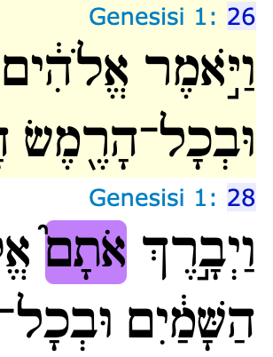
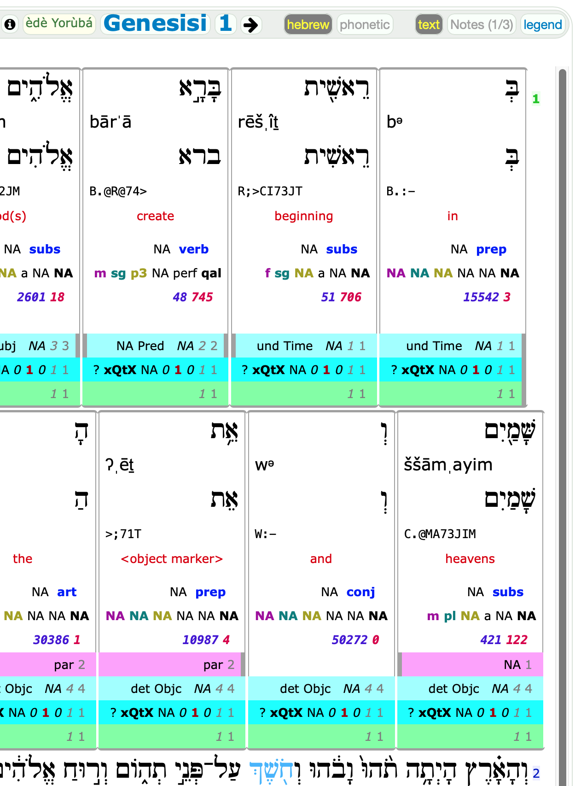

# Text pages

The **text** pages are the bread and butter of shebanq,
they are subdivided into two kinds:

*   **material** pages show a chapter of the Hebrew Bible:
    *   the left sidebar may show related words, queries, notes
    *   the main area shows the text of the chapter,
        as a list of its verses;

*   **record** pages show an individual *word*, *query*, or *note set*;
    we use the term *record* to refer to an individual word, query or
    note set.
    *   the left sidebar shows the characteristics of the
        record, depending on the type of the record,
    *   the main area shows the verses that belong to that record,
        as a list of verses, being:
        *   for a word, the verses where it occurs;
        *   for a query, shows the verses where it has results;
        *   for a note set, the verses where it has members.

## Operation

When a SHEBANQ user navigates on a text page, he can switch between
**material** and **record** pages.

On a **material** page he sees chapter material, in a sidebar he sees lists of
related words, queries, notes.

A click on a related query item opens an `rq` page.

There he sees hits of that query.
Every hit has a link to the chapter the hit is in.
A click on that chapter opens a **material** page for that chapter.

In the sidebars there are again related words, queries, notes.

A click on a related word opens an `rw` page.

And so on.

Under the hood there is just a single page.

All blocks are always present on a text page, but not all are visible.
Two parameters regulate which one are visible

*   *mr* = `m` or `r` (**material** or **record**)
*   *qw* = `w` or `q` or `n` (**word**, **query** or **note set**)

Changes in *mr* and *qw* trigger the showing and hiding of the appropriate
blocks.
Moreover, if needed, fresh content for these blocks is fetched
from the server by means of AJAX calls and inserted into them.

So, during all this navigation, the skeleton of the page does not
change, and the server is only accessed by for partial content.

The controls for content selection and view settings belong to the skeleton.

code type | associated names
--- | ---
JS |  `materialsettings.MaterialSettings`, `sideSettings.sideSettings.js`
view | text.html
controller | `hebrew.text()`


## Skeleton

All text pages have a left side bar and a main area.
Both areas have a header which contains verious controls
that influence the selection and presentation of the content.

Here is a schematic overview.

```
===============================================================================
|all: icon menu                                                         login |
|all:      Text Word Queries Notes                                            |
===============================================================================

======================    =====================================================
|m:w list controls   |    |m:  material controls   book chapter               |
|m:w word list       |    |m:  verse content                            verse |
|m:w                 |    |m:  verse content                            verse |
----------------------    |m:  verse content                            verse |
|m:q list controls   |    =====================================================
|m:q query list      |    |rw: material controls   word page                  |
|m:q query list      |    |rw: verse content                    chapter:verse |
|m:q                 |    |rw: verse content                            verse |
----------------------    |rw: verse content                            verse |
|m:n list controls   |    =====================================================
|m:n note list       |    |rq: material controls   query page                 |
|m:n                 |    |rq: verse content                            verse |
======================    |rq: verse content                            verse |
|rw: record control  |    |rq: verse content                            verse |
|rw: word info       |    =====================================================
|rw:                 |    |rn: material controls   noteset page               |
======================    |rn: verse content                            verse |
|rq: record control  |    |rn: verse content                            verse |
|rq: query info      |    |rn: verse content                            verse |
|rq:                 |    =====================================================
======================
|rn: record control  |
|rn: note set info   |                                            =============
|rn:                 |                                            |text: cite |
======================                                            =============
```

Not all blocks occur on all pages. The *qualifiers* indicate what occurs on what:

qualifier | page type
--- | ---
`all:` | all pages
`text:` | all *text* pages
`m:` | all material *text* pages
`m:w` | all material *text* pages if word sidebar is on
`m:q` | all material *text* pages if query sidebar is on
`m:n` | all material *text* pages if noteset sidebar is on
`rw:` | all record *text* pages of type word
`rq:` | all record *text* pages of type query
`rn:` | all record *text* pages of type noteset

Below we give the elements on these pages.
However, for the sidebars we show only the generic controls, not the elements
that are specific for the kind of sidebar.
See [sidebars](sidebars.md) for those details.

## Material Controls

 
    
### elem-info

link to feature docs of BHSA

code type | associated names
--- | ---
views | versions.html |
CSS |`#select_version`, `source.ctli`
code | [{SelectPassage.apply}][selectpassageapply]

### elem-version

select ETCBC data version

code type | associated names
--- | ---
views | versions.html
CSS | `mvradio.ctl`
code | [{words.View.selectVersion}][viewselectversion], [{SelectPassage.apply}][selectpassageapply], [M:VIEWSETTINGS.currentVersion][viewsettings.VIEWSETTINGS.currentVersion]

### elem-links

each chapter has a link to the same chapter in other tools, such
as [Bible Online Learner]({{bol}}) and [ParaBible]({{parabible}}),
not on **record** pages.

code type | associated names
--- | ---
views | textbody.html
CSS | `#bol_lnk`, `#pbl_lnk`
code | [{SelectPassage.apply}][selectpassageapply]

### elem-language-info

overview of the names of all books in all available languages

code type | associated names
--- | ---
views | textbody.html
CSS | `#thelang`, `#select_control_lang`
code | [C: hebrew.books][controllers.hebrew.books], [M:blang][blang]

### elem-language

switch between languages in which the names of
the books of the bible are presented.

code type | associated names
--- | ---
views | textbody.html
CSS | `#thelang`, `#select_control_lang`
code | [{SelectLanguage}][selectselectlanguage], [C: hebrew.books][controllers.hebrew.books], [M:blang][blang]

### elem-text-representation

select hebrew script or phonetic script

code type | associated names
--- | ---
views | textbody.html
CSS | `mtradio.ctl`, `mhb`, `mph`
code | `tr`, [{MaterialSettings}][materialsettings], [M:VERSECONTENT.plainText][versecontent.VERSECONTENT.plainText]

### elem-text-presentation

select normal running text, or one of several tabular formats.
The tabular formats present the text by *clause atom*,
one clause atom per line, with extra syntactic information added

*   *Notes*: with notes displayed
*   *Syntax*: with indentation according to linguistic embedding
*   *Abstract*: with letter mapped to just a few symbols

code type | associated names
--- | ---
views | textbody.html
CSS | `mhradio.ctl`, `#mtxtp`. `mtxt1`, `#mtxt2`, `mtxt3`
code | `tp`, [{MaterialSettings}][materialsettings], [M:VERSECONTENT.tab1Text][versecontent.VERSECONTENT.tab1Text], [tab2][versecontent.VERSECONTENT.tab2Text], [tab3][versecontent.VERSECONTENT.tab1Text]

### elem-book

select a book of the bible, not on **record** pages

code type | associated names
--- | ---
views | textbody.html
CSS | `#select_control_book`, `#thebook`
code | `book`, [{Material}][material], [{SelectBook}][selectselectbook], [{SelectPassage}][selectselectpassage], [{share}][share], [M:MATERIAL][materials.MATERIAL], [M:BOOKS][books.BOOKS]

### elem-chapter

select a chapter within the current book, not on **record** pages,
with controls to go to next/previous chapters

code type | associated names
--- | ---
views | textbody.html
CSS | `#select_control_chapter`, `#thechapter`
code | `chapter`, [{Material}][material], [{SelectItems}][selectselectitems], [{SelectPassage}][selectselectpassage], [{share}][share], [M:MATERIAL][materials.MATERIAL]

### elem-page

select a page within the list of items associated with
the current record (word/query/note set), not on **material** pages,
with controls to go to next/previous pages

code type | associated names
--- | ---
views | textbody.html
CSS | `#select_control_page`, `#thepage`
code | `page`, [{Material}][material], [{SelectItems}][selectselectitems], [{share}][share], [M:MATERIAL][materials.MATERIAL]

## List Controls

 
    
### elem-highlight-published

show published items only;
not in **word** item lists

code type | associated names
--- | ---
views | textsidebar.html
CSS | `#hlpub[qn]`, `[qn]pradio.ctl`
code | [{SideSettings}][sidesettings], [{NoteVerse}][notesnoteverse], [M:viewdefs.Make][viewdefs.Make]

### elem-highlight-reset

reset the highlighting of all items in this list;
not in **note** item lists

code type | associated names
--- | ---
views | textsidebar.html
CSS | `#hlreset[wq]`, `[wq]hradio.ctl`
code | [{SideSettings}][sidesettings], [M:viewdefs.Make][viewdefs.Make]

### elem-highlight-many

highlight all items in this list;
not in **note** item lists

code type | associated names
--- | ---
views | textsidebar.html
CSS | `#hlmany[wq]`, `[wq]hradio.ctl`
code | [{SideSettings}][sidesettings], [M:viewdefs.Make][viewdefs.Make]

### elem-highlight-custom

highlight only selected items in this list;
not in **note** item lists

code type | associated names
--- | ---
views | textsidebar.html
CSS | `#hlcustom[wq]`, `[wq]hradio.ctl`
code | [{SideSettings}][sidesettings], [M:viewdefs.Make][viewdefs.Make]

### elem-highlight-one

highlight the selected items in this list 
and use only one color for that,
to be selected in the box next to it;
not in **note** item lists

code type | associated names
--- | ---
views | textsidebar.html
CSS | `#hlone[wq]`, `[wq]hradio.ctl`
code | [{SideSettings}][sidesettings], [M:viewdefs.Make][viewdefs.Make]

### elem-highlight-off

turn highlighting off for all items in this list ;
not in **note** item lists

code type | associated names
--- | ---
views | textsidebar.html
CSS | `#hloff[wq]`, `[wq]hradio.ctl`
code | [{SideSettings}][sidesettings], [M:viewdefs.Make][viewdefs.Make]

### elem-highlight-select-single-color

if **highlight one** is chosen,
pick the color used for all highlights;
not in **note** item lists

code type | associated names
--- | ---
views | textsidebar.html
CSS | `#sel[wq]_one`, `colorselect_[wq]`
code | [{SideSettings}][sidesettings], [{ColorPicker1}][colorpickercolorpicker1], [{ColorPicker2}][colorpickercolorpicker2], [{viewState}][viewstateviewstate], [M:viewdefs.Make][viewdefs.Make]

## Record Control

### elem-highlight-select-color

pick the color used to highlight items of this record,
i.e. occurrences of this word or hits of this query;
not in **note** item lists

code type | associated names
--- | ---
views | textsidebar.html
CSS | `#sel[wq]_me`, `colorselect_[wq]`
code | [{SideSettings}][sidesettings], [{ColorPicker1}][colorpickercolorpicker1], [{viewState}][viewstateviewstate]

## Content

The main area presents a verse list.
The verses are those of a chapter for a **material** page,
and those of a record for an **record** page.
Think of query results and word occurrences and notes from a note set.

### elem-goto-chapter


**record** pages show book-chapter indications next to the verses,
which link to the **material** pages of the corresponding book chapters.

code type | associated names
--- | ---
views | material.html
CSS | `cref`
code | [{Material}][material]

### elem-show-verse-data


Both **material** and **record** pages show verse numbers next to the verses,
which are clickable and open a data view of the corresponding verses,
together with a legend button.

code type | associated names
--- | ---
views | material.html
CSS | `vradio`, `#datalegend_control`
code | [{Material.addVerseRefs}][materialaddverserefs]

### elem-feature-legend


The legend can be used to control which features are displayed in data view.
The feature labels in the legend link to the feature documentation
in the [BHSA]({{bhsa}}) repo.

code type | associated names
--- | ---
views | textbody.html, material.html
CSS | `#datalegend_control`
code | [{Material}][material], [{MaterialSettings}][materialsettings], [M:boiler.LEGEND]

## Citation

### elem-cite-slider


At the bottom-right corner of the page is a slider control from where
the user can pick urls for citation.
Which urls are shown is dependent on the contents of the page.

code type | associated names
--- | ---
CSS | `#citeh`
code | [{share}][share]
